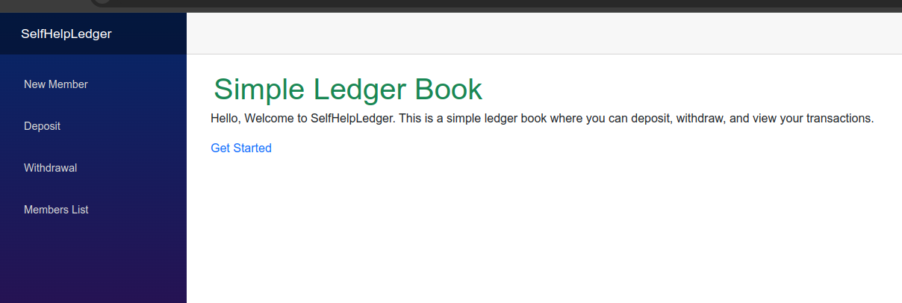
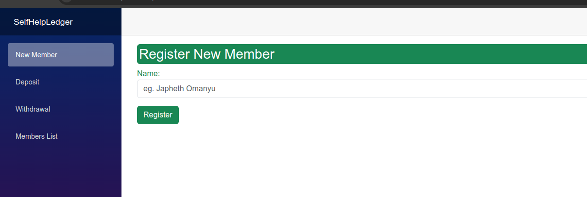
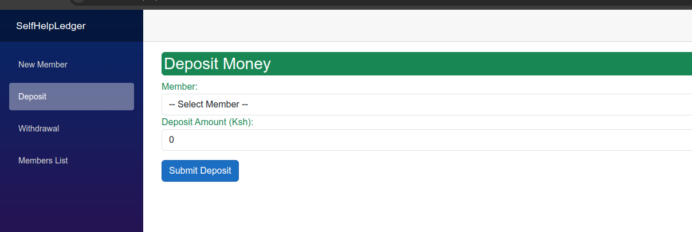
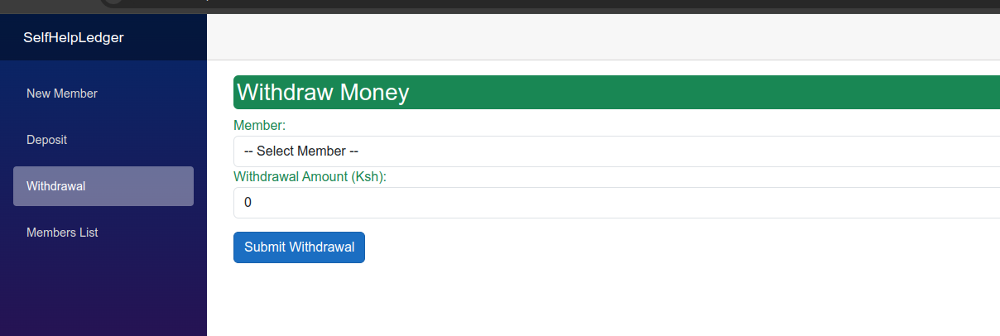
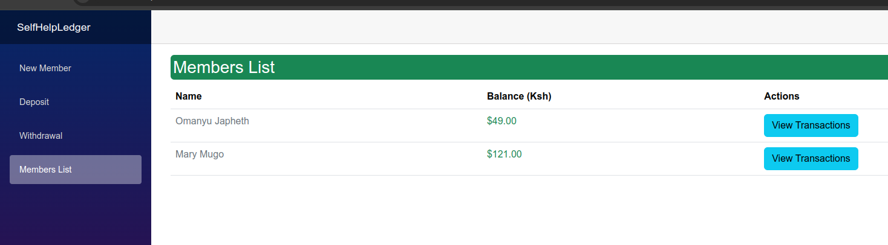
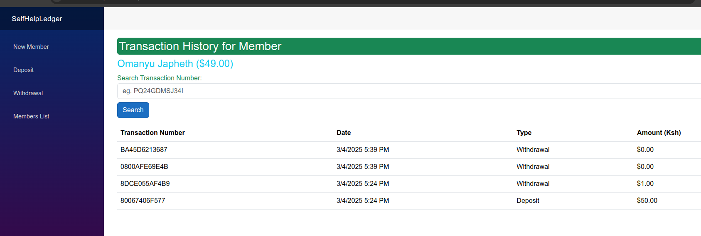

# SelfHelpLedger

SelfHelpLedger is a Blazor Server application designed for a self-help group to manage member registration, deposits, withdrawals, and to view transaction history with a unique 6-character transaction number for each transaction. The app uses SQL Server for data storage.

## Table of Contents

- [Features](#features)
- [Prerequisites](#prerequisites)
- [Installation](#installation)
- [Database Setup](#database-setup)
- [Running the Application](#running-the-application)
- [Navigation](#navigation)

## Features

- **Member Registration:** Add new members with a name and initial balance.
- **Deposits:** Increase a member’s balance by recording deposit transactions.
- **Withdrawals:** Decrease a member’s balance (with sufficient funds) by recording withdrawal transactions.
- **Member List:** Display all registered members with their current balances.
- **Transaction History:** View detailed transactions (including a unique 6-character transaction number) for each member.
- **Transaction Search:** Filter transactions by entering a transaction number.

## Prerequisites

Before running the application, ensure you have the following installed:

- [.NET 9 SDK](https://dotnet.microsoft.com/download/dotnet/9.0)
- [SQL Server](https://www.microsoft.com/en-us/sql-server/sql-server-downloads) (local installation or a cloud instance)
- A code editor (e.g., [Visual Studio Code](https://code.visualstudio.com/))

## Installation

1. **Clone the repository:**

   ```bash
   git clone https://github.com/yourusername/SelfHelpLedger.git
   cd SelfHelpLedger

2. **Database Setup**
## Database Setup
Update Connection String:

In Program.cs, update the connection string to point to your SQL Server instance:
```bash

var connectionString = "Server=localhost;Database=SelfHelpLedger;User Id=sa;Password=YourStrong!Passw0rd;TrustServerCertificate=True;";
builder.Services.AddDbContext<AppDbContext>(options =>
    options.UseSqlServer(connectionString));
```
Replace YourStrong!Passw0rd with your actual SQL Server password.

3. **Create and Apply Migrations:**
Open a terminal in the project directory and run:

   ```bash
   dotnet ef migrations add InitialCreate
   dotnet ef database update

   ```

4. **Run the Application:**
## Running the Application
   ```bash
   dotnet run  
   ```

5. Open a web browser and navigate to `http://localhost:5000` to access the application.

## Navigation
Once the app is running, use the navigation menu to access different features:

New Member:
Register a new member at /members/new.

Deposit:
Record a deposit transaction at /deposit.

Withdrawal:
Record a withdrawal transaction at /withdrawal.

Members List:
View all members and their balances at /members.

Transaction History:
Click on the "View Transactions" button next to a member in the Members List, or navigate directly using /transactions/{MemberId} (e.g., /transactions/1).

Transaction Search:
On the Transaction History page, use the search bar to filter transactions by the unique transaction number.